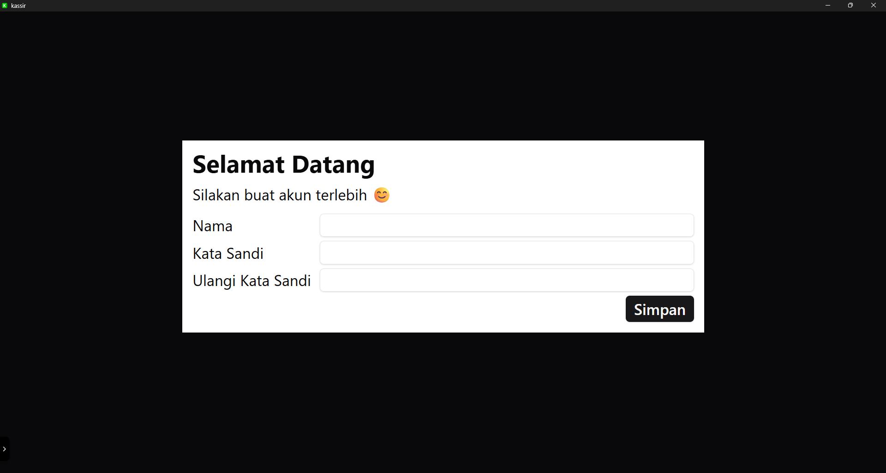

# Pertama Kali

Ketika membuka aplikasi Kassir untuk pertama kali, Anda akan diminta untuk membuat akun admin. Isi formulir pendaftaran dengan informasi yang diperlukan seperti nama dan kata sandi. Setelah mengisi semua data, klik tombol "Simpan" untuk membuat akun admin Anda.

## Membuat Toko Baru

Masukkan tiga data berikut:

1. **Nama Toko** — nama toko Anda (akan muncul di struk dan judul aplikasi)
2. **Nama Pemilik** — nama Anda sebagai pemilik/admin
3. **Kata Sandi** — kata sandi untuk login

Klik tombol **Buat Toko** untuk menyelesaikan setup.

Aplikasi akan:
- Menyimpan akun admin ke database lokal
- Meng-hash kata sandi menggunakan bcrypt (dijalankan di Rust backend)
- Membuat sesi login (JWT dengan masa berlaku 5 hari)
- Mengarahkan ke halaman **Beranda**

:::info
Kata sandi disimpan dalam bentuk hash bcrypt, bukan teks biasa. Tidak ada yang bisa melihat kata sandi Anda, termasuk pembuat aplikasi.
:::

## Setelah Setup

Setelah setup selesai, Anda bisa langsung menggunakan aplikasi. Pada kunjungan berikutnya, halaman **Login** yang akan muncul.
