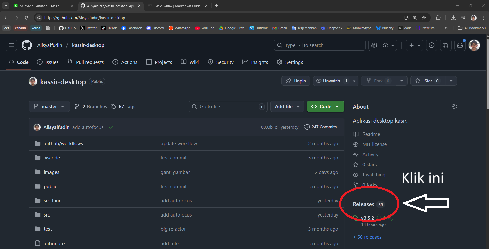
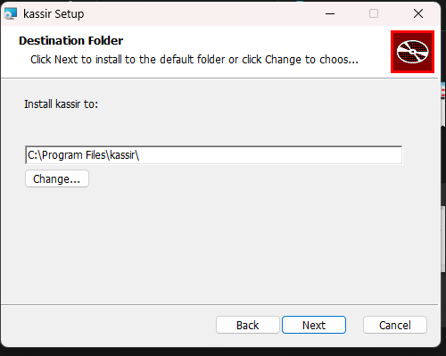

# Instalasi

## Windows

### Unduh

- Buka halaman github proyek di [Github](https://github.com/Alisyaifudin/kassir-desktop).
- Buka halaman **releases**

- Pilih versi aplikasi (paling atas paling baru).
- Unduh file `.msi`.

### Instalasi

- *Double click* file `.msi`.
- Jika pertama kali mencoba instalasi, akan muncul tampilan peringatan seperti ini.

- Klik *More info*. Tampilannya akan berganti menjadi ini.

- Klik *Run anyway*.

- Sisanya, tinggal klik *next* terus (tahulah ya gimana).

- Selesai. Tinggal buka aplikasi 🥳