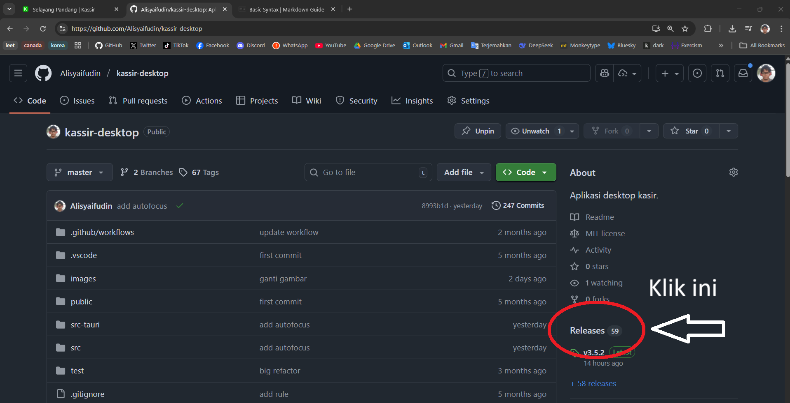

# Selayang Pandang

Informasi sekilas tentang **kassir**

## Fitur

- Mencatat penjualan/pembeli barang.
- Mencatat stok barang.
- Menyimpan data riwayat transaksi.
- Mencatat keuangan
- Mencatat informasi pelanggan

## Instalasi

### Windows

- Buka halaman github proyek di [Github](https://github.com/Alisyaifudin/kassir-desktop).
- Buka halaman **releases**

- Pilih versi aplikasi (paling atas paling baru).
- Unduh file `.msi`.
- Install dengan _double click_ file `.msi`.

Lebih detail, lihat [Instalasi](./install.md).

## Feedback

Kontak saya jika ada masukan atau pertanyaan mengenai aplikasi ini 🥳
